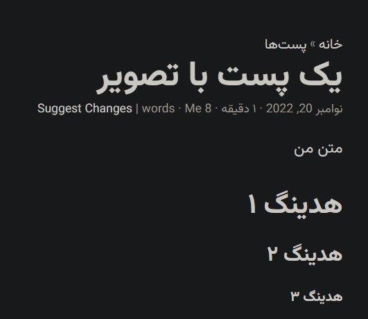
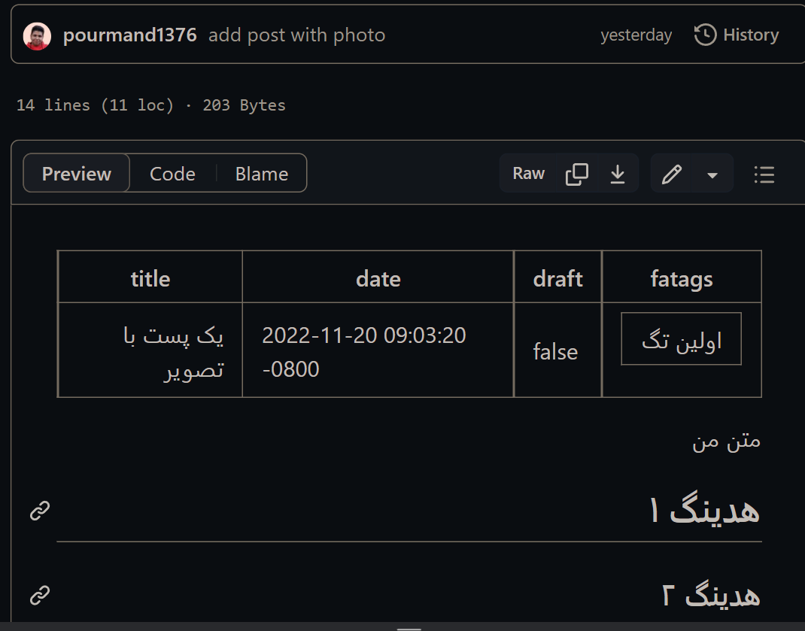
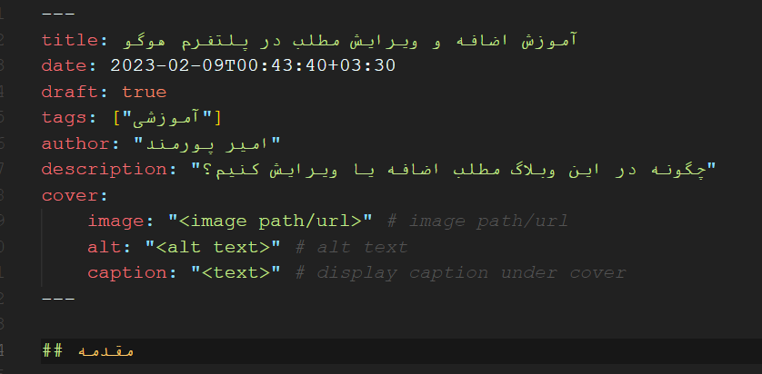

## مقدمه

این وبلاگ بر روی پلتفرم Hugo سوار شده است که ایده اصلی آن «سادگی» هست. در اینجا همه چیز با یک فایل markdown ساده مدیریت میشه و کاربر صرفا درگیر محتوا میشه. 

اگر در مورد markdown نمی‌دونید، شاید بد نباشه ۱۰ دقیقه وقت بذارید و [این ویدئو یوتیوب](https://www.youtube.com/watch?v=2JE66WFpaII) رو ببینید. در [این سایت](https://www.markdownguide.org/basic-syntax/) هم خیلی ساده مارک‌داون رو توضیح داده. به نظرم مارک‌داون هم به درد دنیا و هم به درد آخرت می‌خوره. از طرفی خیلی زشته که یه دانشجو مهندسی کامپیوتر مارک‌داون بلد نباشه. 

## درخواست تغییر یک پست

حال که مارک‌داون رو بلدید به سادگی می‌تونید هر مطلبی که به نظرتون می‌تونه بهبود داده بشه رو در این سایت بهبود بدید. 

بذارید یک مثال بزنم. 


اگر من نوعی یک کاربر معمولی باشم و بخوام تغییراتی بدم، روی Suggest Changes کلیک می‌کنیم. بعد Edit رو می‌زنم و تغییراتم رو میدم و commit می‌کنم (با این پیش‌فرض که می‌دونم از قبل اکانت گیت‌هاب دارید).


در اینجا احتمالا گیت‌هاب می‌بینه که شما مجوز اضافه کردن مستقیم مطلب روی وبلاگ رو ندارید. پس خودش به صورت اتوماتیک یک Fork از وبلاگ می‌سازه. سپس یک Pull Request روی وبلاگ اصلی باز می‌کنه. بعدا مسئول وبلاگ Pull Request شما رو می‌بینه و تایید می‌کنه و به مطالب سایت اضافه میشن. 

تمام این سناریو برای اینه که یک نظارت اولیه‌ای روی مطالب انجام بشه و مطالب اول تایید بشن، بعد انتشار داده بشن. 

همین! به همین سادگی می‌تونید مطالبی که می‌خواید رو اضافه کنید یا تغییر بدید. در ضمن هنگام تغییر مطلب در تب Preview می‌تونید یک پیش‌نمایش از تغییری که داده شده ببینید. 

## تغییر مشخصات یک پست
هر پست وبلاگ حاوی یک frontmatter هست که متادیتای اون پست رو شامل میشه (به جدول موجود در تصویر بالا نگاه کنید). مشخص کردنش خیلی ساده است. ابتدای فایل markdown سه تا خط تیره در بالا و پایین میذارید و بینش در مورد پست توضیح می‌دید (مانند شکل زیر). بعد از اون هم مطالب پست نوشته میشن. 



با این سیستم اضافه کردن یک پست جدید هم ساده است. کافیه یک فولدر داخل content/posts بسازید و یک فایل index.md داخلش اضافه کنید و frontmatter رو از یکی از پست‌های دیگه کپی کنید و تغییرش بدید. 

حدس می‌زنم همین الان دارید به این فکر می‌کنید که باید یک روش اتوماتیک برای انجام این کار وجود داشته باشه. بله وجود داره. اگر hugo رو روی سیستم‌تون نصب کنید (حجمش خیلی کمه)، با زدن یک کامند این فایل بصورت آماده براتون تولید میشه. 

```
hugo new content/posts/my-new-post/index.md
```

تمپلت کلی فایل جدید هم از فولدر archetypes که در روت پروژه موجود هست برداشته میشه. 

## اضافه کردن فایل یا عکس
مدیریت مطالب تو سیستم هوگو به این شکل هست که تمام فایل های markdown (با فرمت md) که داخل پوشه `content/posts` قرار بگیره رو داخل وبلاگ منتشر می‌کنه. 

برای این که مطالب منظم‌تر باشند و دسته‌بندی بهتری داشته باشیم می‌تونیم به ازای هر پست یک پوشه بسازیم. مثلا من برای این پست یک پوشه به نام `adding-new-content` ساختم و داخل اون یک فایل `index.md` درست کردم. حال می‌تونید تمام فایل‌هایی که دوست دارید داخل پست به اونها رفرنس بدید رو داخل این پوشه اضافه کنید. 

مثلا اگر من بخوام یک تصویر به نام `sample.png` رو داخل وبلاگ نشون بدم می‌تونم بگم `` و تصویر به درستی داخل وبلاگ نمایش داده میشه. همین مساله برای فایل‌های pdf، word و هر فرمت دیگه‌ای قابل انجام هست. 

## پایان
فکر نمی‌کنم نیاز باشه برای نوشتن در اینجا چیز بیشتری یاد بگیرید. من خودم به شخصه حتی برای نوشتن یادداشت‌های روزانه‌ام از مارک‌داون استفاده می‌کنم. فعلا هم ابزار Obsidian رو برای اینکار انتخاب کردم. بسیار ابزار ساده و جذابی هست. 

هدف اصلی این وبلاگ ساختن یک ویکی تعاملی برای نسل‌های آینده بوده. یک ویکی که هر دانشجو هم ازش استفاده کنه، هم بهش مطالب مفیدی اضافه کنه که آیندگان استفاده کنند. 

دگران کاشتند و ما خوردیم / ما بکاریم و دیگران بخورند ([+](https://ganjoor.net/bahar/4parebk/sh4))

